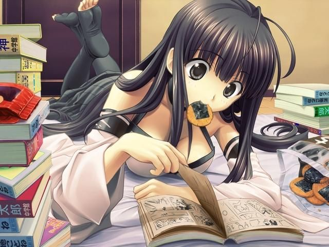

<h1 align="center">Hello!! Welcome to my profile ꉂ(˵˃ ᗜ ˂˵)</h1>

    
    
I'm a full-stack developer! Cute designs, big databases and user security are my favorite topics when it comes to coding!    I love cats, dinosaurs and aquatic creatures  my favorite dinosaur is the triceratops (˶ᵔ ᵕ ᵔ˶)

    
lets bring old web and cute moe designs back 

 
 

    
    
    
    

------------------------------------------------------------------------

Thanks for reading ♡

